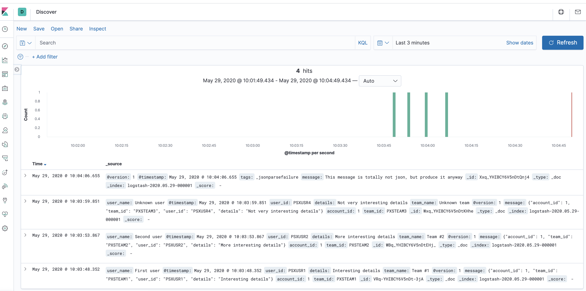

## Overview

POC of `Logstash` pulling from a `kafka` topic and populating `Elasticsearch` index

## Quck start

- Start kafka in the `dockerfiles` repo:
    ```
    $ pwd
    /Users/agrachtchouk/dev/dockerfiles/composes
    $ ./kafka-zookeeper.zsh up -d    
    ```

- Start the kafka shell and create the topic
    ```
    docker run --net zookeeper_main --rm -v /var/run/docker.sock:/var/run/docker.sock -e HOST_IP=zookeeper_kafka_1 -e ZK=zookeeper_zookeeper_1:2181 -i -t wurstmeister/kafka:2.11-1.1.1 /bin/bash
    ```
    ```
    $KAFKA_HOME/bin/kafka-topics.sh --delete --topic topic --zookeeper $ZK
    ```
    ```
    $KAFKA_HOME/bin/kafka-topics.sh --create --topic topic \
    --partitions 4 --zookeeper $ZK --replication-factor 1
    ```
    ```
    $KAFKA_HOME/bin/kafka-topics.sh --describe --topic topic --zookeeper $ZK
    ```

- Start the pre-configured ELK stack
    ```
    $ docker-compose up 
    ```

## How do I know it has all started?
Look for a log line similar to:
    ```
    logstash | [2020-05-29T05:50:38,937][INFO ][logstash.agent           ] Successfully started Logstash API endpoint {:port=>9600}
    ```

## So, the containers have started, now what?

### Start the kafka shell and a consumer to watch the messages flowing
```
docker run --net zookeeper_main --rm -v /var/run/docker.sock:/var/run/docker.sock -e HOST_IP=zookeeper_kafka_1 -e ZK=zookeeper_zookeeper_1:2181 -i -t wurstmeister/kafka:2.11-1.1.1 /bin/bash
```
```
$KAFKA_HOME/bin/kafka-console-consumer.sh --topic=topic --zookeeper=$ZK
```

### Start another kafka shell to produce some messages
```
docker run --net zookeeper_main --rm -v /var/run/docker.sock:/var/run/docker.sock -e HOST_IP=zookeeper_kafka_1 -e ZK=zookeeper_zookeeper_1:2181 -i -t wurstmeister/kafka:2.11-1.1.1 /bin/bash
```
```
$KAFKA_HOME/bin/kafka-console-producer.sh --topic=topic \
--broker-list=`broker-list.sh`
```
```
{"account_id": 1, "team_id": "PXSTEAM1", "user_id": "PSXUSR1", "details": "Interesting details"}

{"account_id": 1, "team_id": "PXSTEAM2", "user_id": "PSXUSR2", "details": "More interesting details"}

{"account_id": 1, "team_id": "PXSTEAM3", "user_id": "PSXUSR4", "details": "Not very interesting details"}

This message is totally not json, but produce it anyway
```

## View messages is ES (using Kibana)
- Notice the event enrichment (team and user names added) that occured due to the pipeline [configuration](./pipeline/logstash.conf)
  


## Something does not work:
- Make sure the topic is created
- Start with a clean slate: 
  - `docker rm $(docker ps -aq)`
  - `docker volume rm zookeeper_kafkadata zookeeper_kafkalogs zookeeper_zookeeperdata`
